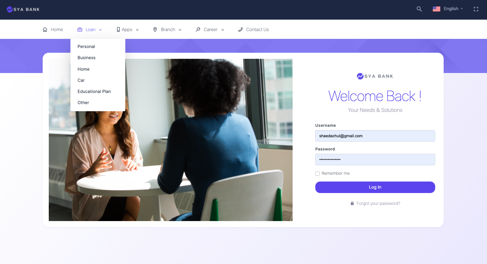
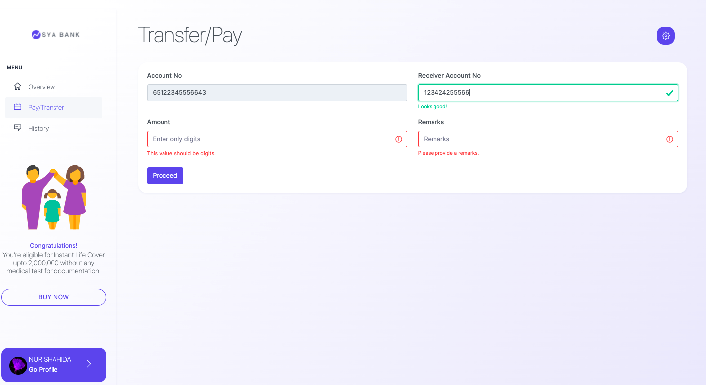
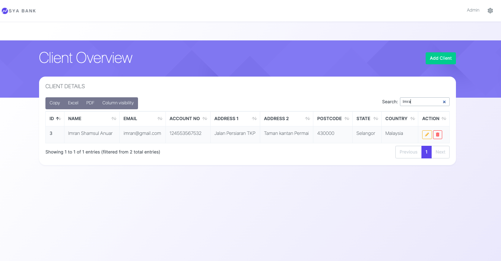

# SYA BANK SYSTEM

## Features

1. Client User

- Login and Logout
- View and update his account details
  c. View his transactions history
  d. Transfer money to others

2. Admin User
   a. Login and logout
   b. Create new client account
   c. Update existing client information
   d. View searchable and sortable list of clients

## Tech

Sya bank uses a number of open source projects to work properly:

- [Laravel] - PHP enhanced for web apps!
- [Bootstrap] - great UI boilerplate for modern web apps
- [AWS Elestic Beanstalk] - the streaming build system
- [AWS EC Key] - as key
- [jquery] - any related to function
- [github] - control version

## Installation

Laravel requires php 8 to run.

Clone project from git repo.

```sh
git clone https://github.com/shahidaothman/laravel_test.git
```

Access the folder...

```sh
cd laravel_test
```

Create enviroment

```sh
touch .env
cp .env.example .env
php artisan key:generate
php artisan config:cache
```

Run project

```sh
php artisan serve
```

## Snapshots

Homepage layout



# Client

Homepage for client. They can see their balance, account no, and any related details


Client click on Pay/Transfer tab to make transcation. Client need to enter based on validation given.



Receiver details will pop up


if transaction success, there will will outomated pop up show success.


Next client click on history tab. all transaction will appear.


Client can download and save data to local.Client can choose any type file they want (Excel,pdf).


Click icon cog on top right bar, the dropdown option show profile or logout.


Client click on profile.


Click edit to edit profile, the popup show.


The animation will show on top right if edit success


# Admin

Admin main page


Click on pencil icon to edit client


The pencil icon will turn to save icon. Click on save icon to proceed.


Click on top right green button "add client" to add new client. Add and save


Admin can sort, export and search client



## Demo

[Demo](hhttp://shahida-env.eba-shrz5e9k.us-east-1.elasticbeanstalk.com/)

[This is an external link to genome.gov] (https://www.genome.gov/)
